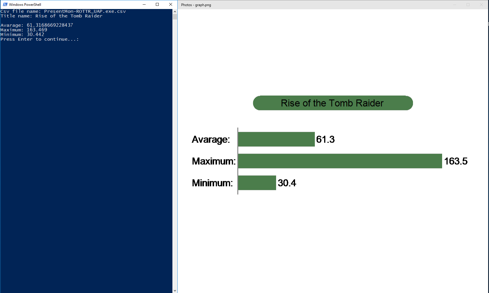

# PresentMon-graph-creator
PresentMon graph creator is a little tool to create a simple png image showing avarage, max and min FPS of an application, monitored with [PresentMon](https://github.com/GameTechDev/PresentMon), using a csv file generated by it.
You run it from powershell with "C:\to\path\graph.ps1" where "C:\to\path\" is the place where you downloaded your "graph.ps1". After this if you want you can customize it with the two optional inputs:
* "Csv file name: " is the location of the csv file(it can use both relative and absolute paths). If omitted it will try to search in the current directory a file called "graph.csv".
* "Title name: " is the title you want to add on top of the graph. If omitted it will output the graph directly without the title and remove the 100px heigth for it.
Check the wiki for more informations about customization.
## Examples
An example of input and its image output:

