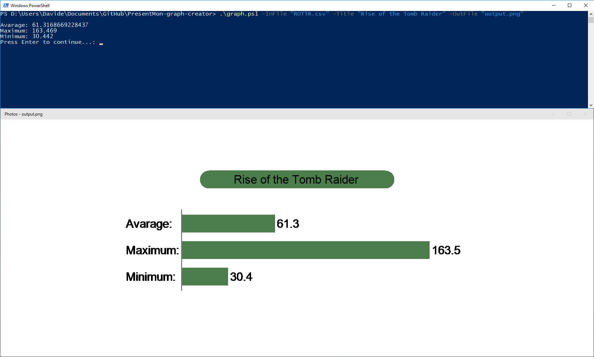

# PresentMon-graph-creator
PresentMon graph creator is a little tool to create a simple png image showing avarage, max and min FPS of an application, monitored with [PresentMon](https://github.com/GameTechDev/PresentMon), using a csv file generated by it.
You run it from powershell with "C:\to\path\graph.ps1" where "C:\to\path\" is the place where you downloaded your "graph.ps1". Check the wiki for more informations about customization.
## Examples
An example of input and its image output:

An example of execution with arguments:

